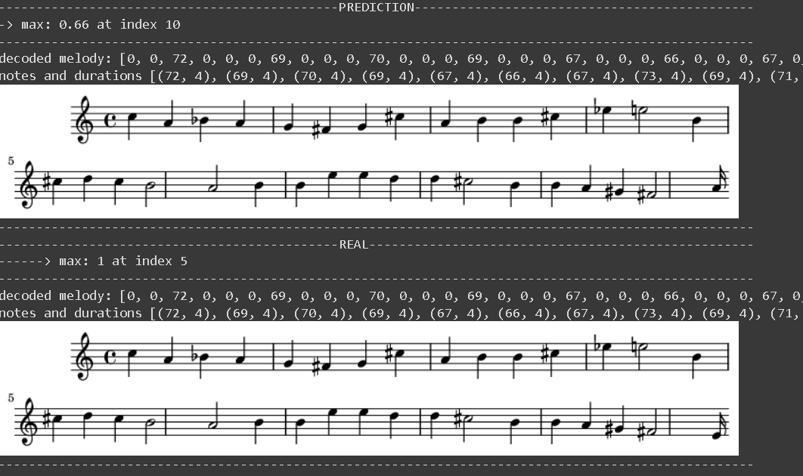

# melody-generator

This project was developed for the winter Deep Learning course at JEDI Academy in 2021-22 Q1.

## Objective
The aim of the project is to continue any given melody in a Baroque style by training a Neural Network on Bach's Chorales.

## Contents
- chorales.lisp : Original dataset format take from the [UCI Repository](https://archive.ics.uci.edu/ml/datasets/Bach+Chorales).
- chorales.csv : Parsed dataset saved in csv format for easier access.
- melody_generator.ipynb : Notebook with the analysis and code of the project.
- best_model.zip : The best model found when training the model (See [Conclusions](#conclusion-and-future-work)).

## Libraries and Software Used

- pandas
- numpy
- matplotlib
- tensorflow
- keras
- music21
- lilypond
- fluidsynth

## Methodology

For a complete description of the project refer to the Notebook in which each step is thoroughly  explained.

## Conclusion and Future Work

Most of the time the model fails to generate something with a melodic nature due to a poor representation of the input data of the model. Given that the representation only takes into account the pitch of a note and introduces a 'repeat' symbol to represent the duration of each note the model tends to generate only the repetition symbol because of its high occurence in the treated dataset.

As future work, a better data representation could be implemented in order to succesfully generate melodies with some meaning and also add more information to the training, such as the Fermata symbols which may introduce knowledge of start and ending of complete musical ideas.

